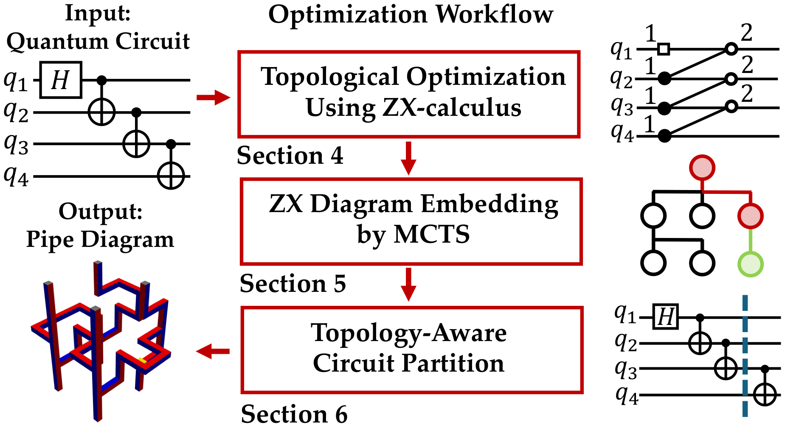
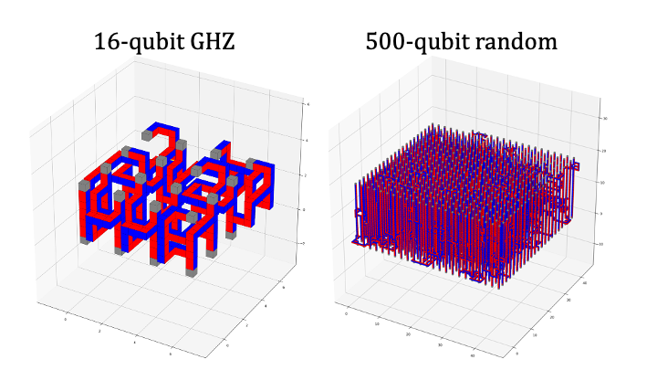

# TopoLS: Topological Lattice Surgery


TopoLS leverages the topological nature of lattice surgery to convert quantum circuit into corresponding logical circuit based on surface code.


## ✨ Overview

TopoLS performs compilation in three stages:

<p align="center">
  
</p>

---

### 🟦 1. ZX-Level Topological Optimization

Quantum circuits are transformed into **ZX diagrams**, where
spider fusion simplifies the structure.

The resulting ZX graph is then **layer-sliced based on topological connectivity**, directly exposing merge–split operations and enabling
space–time volume reductions that are not visible in gate-based representations.

---

### 🟦 2. 3D Layout Optimization via MCTS

Using the enriched ZX diagram with layer information,
we apply **Monte Carlo Tree Search (MCTS)** to explore efficient
3D embeddings of operations.

MCTS guides compilation toward layouts with reduced
space–time volume by searching over embedding decisions.

---

### 🟦 3. Topology-Aware Circuit Partitioning


To ensure scalability, circuits are dynamically partitioned
based on spider connectivity.

This limits the number of operations per layer,
keeping the embedding problem tractable while preserving
topological optimization benefits.

---

Resources for TopoLS:

- 📄 **Paper**  
👉 [TopoLS: Lattice Surgery Compilation via Topological Program Transformations](https://arxiv.org/abs/2601.23109).

- 🎥 Video:  
👉 [TopoLS Presentation at TQEC](https://drive.google.com/file/d/12-Uby-_GgCEUzkFRkGJn-41uRcGZoh5H/view).

- 📊 Slide:  
👉 [TopoLS Slide](https://drive.google.com/file/d/1vOckwK4KiAtYmOgA3LbHbEPJ3BVxh2Ri/view?usp=sharing).

## 🚀 Examples

We demonstrate the compilation results of TopoLS on two representative cases: 
a 16-qubit GHZ state and a 500-qubit random circuit.

<p align="center">
  
</p>

A detailed usage tutorial is available in `tutorial/tutorial.ipynb`.  
To reproduce the main experimental results reported in the paper, run `tutorial/exp.py`.

## 🔗 Operates with TQEC

TopoLS compiles circuits into a lattice-surgery pipe diagram, which can be directly consumed by TQEC for simulation and resource evaluation.

<p align="center">
  
</p>

## :zap: Quick Start

### Using UV

Running 16-qubit GHZ state compilation:
```bash
# Clone the repository
git clone https://github.com/tqec/TopoLS.git
cd TopoLS

# Sync environment
uv sync  # TopoLS
# or
uv sync --group integration  # TopoLS w. TQEC/tqec

# Opt for an editable installation
uv pip install -e .

# Try out one script
cd tutorial
uv run prog.py -f ghz_16 -b 20 -zx 1 -dir 1 -l 4 -r 0 -s 2 -t 2 -i 1000 -csv result -sp 0 -b0 0

```

### Using pip
Running 16-qubit GHZ state compilation:
```bash
# Clone the repository
git clone https://github.com/tqec/TopoLS.git
cd TopoLS

# Create virtual environment
python3 -m venv .venv
source .venv/bin/activate

# Install the package
pip install -r requirements.txt
pip install -e .

# Try out one script
cd tutorial
python3 prog.py -f ghz_16 -b 20 -zx 1 -dir 1 -l 4 -r 0 -s 2 -t 2 -i 1000 -csv result -sp 0 -b0 0

```

## 🛠 Installation

We recommend installing TopoLS inside a virtual environment.

```bash
# Create virtual environment
python3 -m venv .venv
source .venv/bin/activate

# Clone the repository
python3 -m pip install git+https://github.com/tqec/TopoLS.git

```

## 📖 Citation

If you use **TopoLS** in your research, please cite this work:

```bibtex
@misc{zhou2026topols,
  author        = {{Zhou}, Junyu and {Liu}, Yuhao and {Decker}, Ethan and {Kalloor}, Justin and {Weiden}, Mathias and {Chen}, Kean and {Iancu}, Costin and {Li}, Gushu},
  title         = {{TopoLS: Lattice Surgery Compilation via Topological Program Transformations}},
  journal       = {arXiv e-prints},
  keywords      = {Quantum Physics},
  year          = 2026,
  month         = jan,
  eid           = {arXiv:2601.23109},
  pages         = {arXiv:2601.23109},
  doi           = {10.48550/arXiv.2601.23109},
  archiveprefix = {arXiv},
  eprint        = {2601.23109},
  primaryclass  = {quant-ph},
}