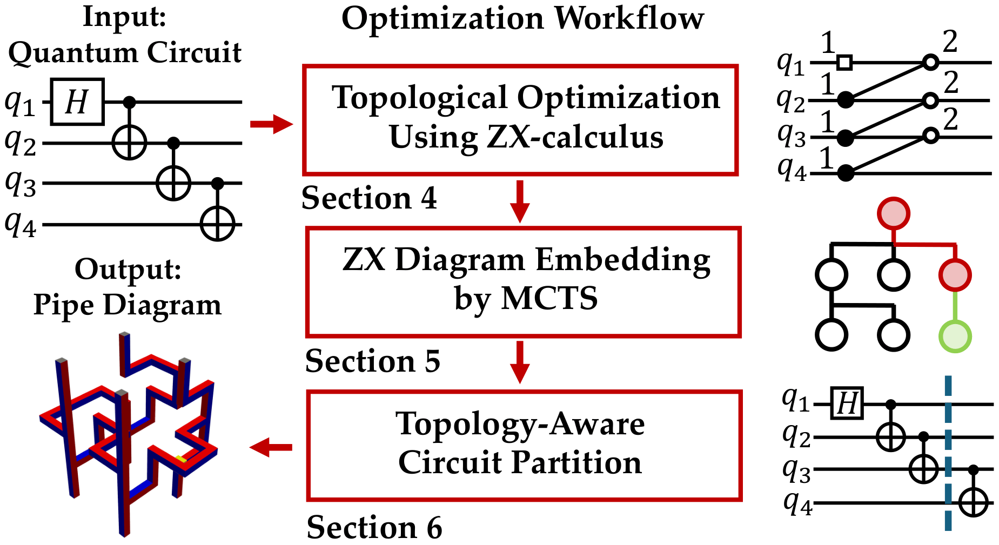
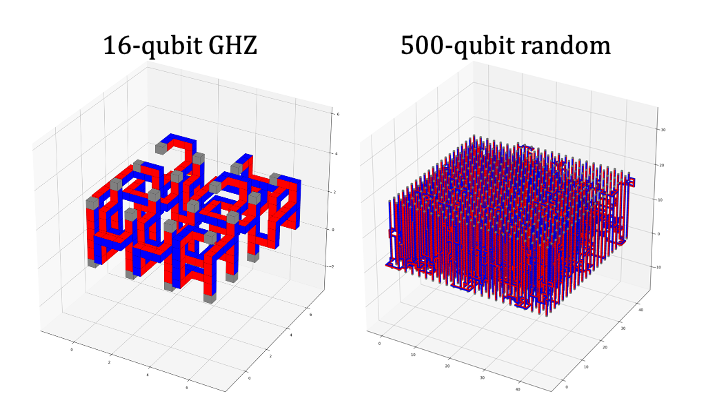
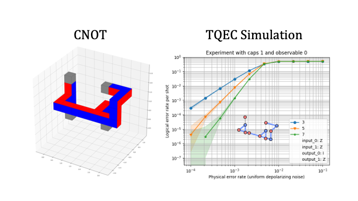

# TopoLS: Topological Lattice Surgery

TopoLS compiles a quantum circuit into a lattice-surgery *pipe diagram* on
the surface code, minimising space–time volume, and exports it in a form
that [TQEC](https://github.com/tqec/tqec) can simulate.

## ✨ Overview

TopoLS performs compilation in three stages:

<p align="center">
  
</p>

### 🟦 1. ZX-level topological optimization

The circuit is turned into a **ZX diagram** and simplified by spider
fusion. The diagram is then **layer-sliced by topological connectivity**,
which exposes merge–split operations directly and enables space–time
reductions invisible in a gate-based representation.

### 🟦 2. 3D layout optimization via MCTS

Each layer of the ZX diagram is embedded into a 3D grid (two spatial axes
plus time) by **Monte Carlo Tree Search**: spiders become cubes, wires are
routed between them, and the search minimises the resulting space–time
volume while keeping every pipe colour-consistent.

### 🟦 3. Topology-aware circuit partitioning

Large circuits are partitioned into blocks by spider connectivity, which
bounds the size of each embedding problem while preserving the
topological optimization.

Resources:

- 📄 **Paper** — [TopoLS: Lattice Surgery Compilation via Topological Program Transformations](https://arxiv.org/abs/2601.23109)
- 🎥 **Talk** — [TopoLS presentation at TQEC](https://drive.google.com/file/d/12-Uby-_GgCEUzkFRkGJn-41uRcGZoh5H/view)
- 📊 **Slides** — [TopoLS slides](https://drive.google.com/file/d/1vOckwK4KiAtYmOgA3LbHbEPJ3BVxh2Ri/view?usp=sharing)
- 🏗 **How the code is organised** — [`docs/ARCHITECTURE.md`](docs/ARCHITECTURE.md)

## 🚀 Examples

Compilation results on a 16-qubit GHZ state and a 500-qubit random circuit:

<p align="center">
  
</p>

## 🛠 Installation

Requires Python ≥ 3.10.

```bash
git clone https://github.com/tqec/TopoLS.git
cd TopoLS

# with uv
uv sync

# or with pip, inside a virtual environment
python3 -m venv .venv && source .venv/bin/activate
python -m pip install -e .
```

## ⚡ Quick start

All scripts run from the `docs/` directory and read circuits from
`docs/benchmark/<name>.qasm`.

```bash
cd docs

# 1. compile the 16-qubit GHZ circuit
uv run prog.py -f ghz_16 -b 20 -zx 1 -dir 1 -l 4 -r 0 -s 2 -t 2 -i 1000 -csv result -sp 0 --backtrack 1
#    -> result/topols/ghz_16.pkl   (embedding)   result/topols/result.csv  (one row of metrics)

# 2. export to TQEC and render
uv run 2tqec.py -f ghz_16 -p True      # result/bgraph/ghz_16.bgraph + result/visualization/ghz_16.png
uv run 2tqec.py -f ghz_16 -i True      # result/visualization/ghz_16_interactive.html (drag / rotate / zoom)

# 3. simulate a block graph with TQEC (small circuits only): compile and export a CNOT, then simulate
uv run prog.py -f CNOT -b 20 -zx 1 -dir 1 -l 4 -r 0 -s 2 -t 2 -i 1000 -csv result -sp 0
uv run 2tqec.py -f CNOT
uv run python -m topols.tools.pipe_sim -f CNOT   # result/simulation/CNOT_*.html, CNOT_lep_*.png
```

With pip, replace `uv run` by `python3` (and `uv run python` by `python3`).
The same workflow, step by step, is in
[`docs/tutorial.ipynb`](docs/tutorial.ipynb); open it with

```bash
uv run --with jupyterlab jupyter lab docs/tutorial.ipynb    # or: pip install jupyterlab
```

The scripts in `docs/` are
thin command-line front ends; everything they do is available as functions
in the `topols` package (`topols.pipeline.prepare_graph`,
`topols.driver.operation`, `topols.export.bgraph.build_pipe_diagram`, …).

## 🎛 `prog.py` options

| option | meaning |
|---|---|
| `-f NAME` | circuit `docs/benchmark/NAME.qasm` |
| `-b N` | maximum block size for circuit slicing (default 20) |
| `-zx 0/1` | ZX simplification off/on |
| `-dir 0/1` | direction (orientation) optimization off/on |
| `-l N` | qubits per row of the 2D footprint (e.g. 4 for 16 qubits) |
| `-r N`, `-s K` | first random seed, and how many consecutive seeds to search in parallel |
| `-t SEC` | wall-clock budget per MCTS call (each layer, each seed) |
| `-i N` | maximum MCTS iterations per call |
| `--backtrack K` | when a layer cannot be embedded from the best previous-layer state, retry it from up to K of the other seeds' previous-layer states before falling back to coarser strategies (0 = off) |
| `-sp N` | for dense circuits: spread gates over rows so that no row holds more than N gates (0 = off) |
| `-csv NAME` | append the metrics row to `result/topols/NAME.csv` |

The search is *anytime*: for a fixed seed and starting state the sequence
of MCTS iterations is deterministic, so a larger `-t` or `-i` only extends
the same search and cannot return a worse layer. More seeds (`-s`) explore
independent searches in parallel (one process per seed, up to the CPUs
available) and keep the best; `--backtrack` guards against a low-volume
layer state that turns out to be a dead end for the next layer.

Outputs: `result/topols/<name>.pkl` holds the embedding (positions,
orientations, spider types, routed paths, I/O ports, volume, compile time);
the CSV row repeats the metrics. `2tqec.py` writes `result/bgraph/` and
`result/visualization/`; `topols.tools.pipe_sim` writes `result/simulation/`.

## 📊 Reproducing the paper

`docs/exp.py` runs the nine benchmarks in the three configurations of the
paper (Full-Opt, no direction optimization, small blocks). The Full-Opt
commands use the per-benchmark search budgets below, chosen so that each
benchmark's volume improves over the uniform `-s 2 -t 2` setting without a
longer compile time (measured one compile at a time, 16 cores):

| benchmark | `-s 2 -t 2` volume / time | tuned setting | volume / time |
|---|---|---|---|
| bv_16 | 486 / 14 s | unchanged | 486 / 14 s |
| dj_16 | 729 / 17 s | `-s 8 -t 2 --backtrack 3` | **567** / 24 s |
| ghz_16 | 891 / 61 s | `-s 2 -t 2 --backtrack 1` | **243** / 14 s |
| vqe_16 | 3888 / 152 s | `-s 4 -t 2 --backtrack 3` | 3645 / 214 s |
| wstate_16 | 8262 / 159 s | `-s 8 -t 2 --backtrack 1` | 8019 / 171 s |
| qaoa_16 | 4941 / 261 s | `-s 8 -t 2 --backtrack 3` | **3969** / 230 s |
| grover_6, qft_16, qpe_16 | — | `-s 2 -t 2` | 22785 / 592 s, 36369 / 1218 s, 39609 / 1321 s |

Volumes are space–time volumes in units of surface-code cubes; wall times
include compilation only. Run-to-run variation exists because `-t` is a
wall-clock budget.

```bash
cd docs
uv run exp.py                  # all three configurations, several hours
uv run exp.py full             # or any subset of: full part place
```

`exp.py` ends with a summary table (volume and compile time per benchmark
and configuration), also written to `result/topols/summary.csv`.

## 🖼 Visualization and simulation

- `2tqec.py -f NAME -p True` — static image of the pipe diagram
  (`result/visualization/NAME.png`); `-i True` — interactive HTML
  (`NAME_interactive.html`). Cubes are coloured by their X/Z boundaries,
  S gates green, T gates purple, input/output ports grey; a yellow band on
  a pipe marks a colour change (a Hadamard).
- `python -m topols.tools.viz_region -f NAME --xmin .. --xmax .. --ymin .. --ymax .. --zmin .. --zmax .. -o OUT` —
  interactive rendering of one region of a large diagram, with node ids.
- `python -m topols.tools.pipe_sim -f NAME` — rebuilds the exported
  `.bgraph` as a TQEC `BlockGraph` and simulates it with sinter
  (`result/simulation/`).

Both read `result/` relative to the current directory, so run them from
`docs/`.

## 🔗 Operates with TQEC

TopoLS compiles circuits into a lattice-surgery pipe diagram that TQEC can
consume directly for simulation and resource evaluation.

<p align="center">
  
</p>

## 🧩 Notes

- **Magic states.** All magic-state gates are treated as T gates, since
  they share the same execution pattern in lattice surgery; translate other
  magic gates to T before compiling.
- **Run-to-run variation.** `-t` is a wall-clock budget, so volumes can
  differ slightly between runs and machines; the deterministic small
  benchmarks (bv_16, dj_16, ghz_16) reproduce exactly.

## 📖 Citation

If you use **TopoLS** in your research, please cite:

```bibtex
@misc{zhou2026topols,
  author        = {{Zhou}, Junyu and {Liu}, Yuhao and {Decker}, Ethan and {Kalloor}, Justin and {Weiden}, Mathias and {Chen}, Kean and {Iancu}, Costin and {Li}, Gushu},
  title         = {{TopoLS: Lattice Surgery Compilation via Topological Program Transformations}},
  journal       = {arXiv e-prints},
  keywords      = {Quantum Physics},
  year          = 2026,
  month         = jan,
  eid           = {arXiv:2601.23109},
  pages         = {arXiv:2601.23109},
  doi           = {10.48550/arXiv.2601.23109},
  archiveprefix = {arXiv},
  eprint        = {2601.23109},
  primaryclass  = {quant-ph},
}
```
